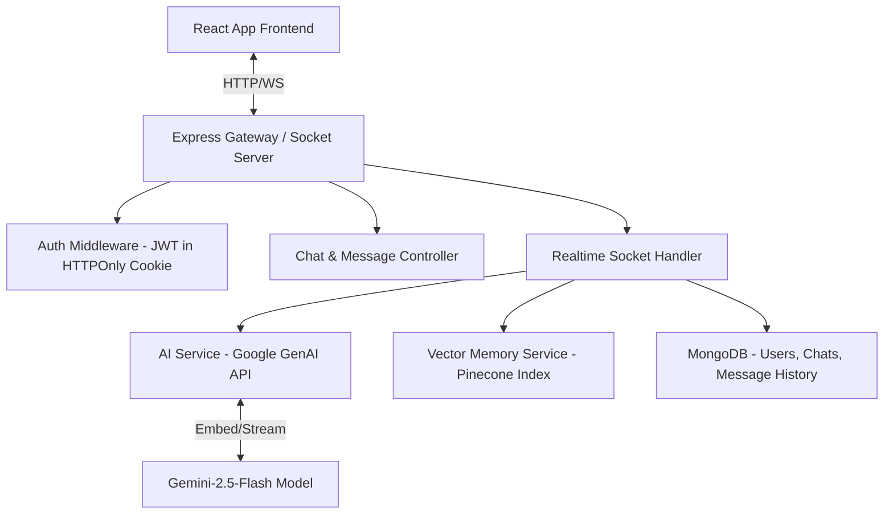

# ChatGPT Interface and Backend Enhancement Plan

This plan details the implementation strategy for creating a premium, modern ChatGPT-like user interface and upgrading the backend architecture with robust APIs, memory management, and modern streaming capabilities.

## User Review Required

> [!IMPORTANT]
> **API URL Configuration**: The frontend currently has the production API backend URL hardcoded. We propose changing this to use dynamic environment variables (`import.meta.env.VITE_API_URL` with a fallback to local server) to allow seamless local development and deployment.
> **Database & Vector Indexing**: To enable the long-term memory feature locally, a local MongoDB database and a Pinecone Index named `chat-gpt` with `768` dimensions (using cosine metric) are required. Please ensure these credentials are ready.

---

## Open Questions

> [!NOTE]
>
> 1. **Streaming vs WebSocket**: Should we implement AI token-by-token streaming using Server-Sent Events (SSE) via standard HTTP, or continue using Socket.io? We recommend SSE for standard API responses as it is lightweight and matches OpenAI's standard structure, but Socket.io is already configured in the codebase and can also stream chunks.
> 2. **AI Persona**: Would you like to enable a specific AI persona (e.g., the local Delhi/Mumbai vibe "Bawla" persona commented out in the AI service, or a professional ChatGPT assistant)? We will add a setting/dropdown in the UI to choose personas.

---

## Proposed Changes

### Component 1: Frontend User Interface (ChatGPT Style Refresh)

We will upgrade the frontend CSS and React components to match the modern ChatGPT look, focusing on dark mode by default, glassmorphism, responsive elements, and clean animations.

#### [MODIFY] [global.css](file:///c:/Users/bhavishya%20plawat/Desktop/Learning/Backend/day%2013%20chatgpt/frontend/src/styles/global.css)

- Implement updated design tokens (`--bg-app`, `--bg-sidebar`, etc.) with dark-theme focus.
- Add styles for glassmorphism containers, chat input panels, and beautiful smooth gradients.
- Add code highlighter syntax formatting and scrollbar overrides.

#### [MODIFY] [Chat.css](file:///c:/Users/bhavishya%20plawat/Desktop/Learning/Backend/day%2013%20chatgpt/frontend/src/styles/Chat.css)

- Refactor the sidebar, chat input, and message lists to match modern chat UI structures.
- Implement collapsible sidebar slide transition animations.
- Create message bubble style improvements with avatars and interactive utility buttons (Copy code, Regenerate, Delete).

#### [MODIFY] [Sidebar.jsx](file:///c:/Users/bhavishya%20plawat/Desktop/Learning/Backend/day%2013%20chatgpt/frontend/src/components/Sidebar.jsx)

- Redesign the sidebar:
  - Add collapsible desktop sidebar toggler (chevron btn).
  - Add action buttons next to each chat item (Edit/Rename title, Delete chat) with tooltips.
  - Implement active state with subtle indicator.
  - Display the logged-in user's profile/initials at the bottom with a popup menu containing "Clear Memory", "Settings", and "Logout".

#### [MODIFY] [ChatLayout.jsx](file:///c:/Users/bhavishya%20plawat/Desktop/Learning/Backend/day%2013%20chatgpt/frontend/src/pages/ChatLayout.jsx)

- Refactor to handle new events:
  - Dynamic API URL loading (local dev support).
  - New chat title auto-generation triggered on the first message.
  - Delete chat and edit chat updates.
  - Landing grid showing prompt card suggestions (e.g. "Draft an email", "Explain coding concepts", "Create a workout plan") when no chat is selected or active.

#### [MODIFY] [ChatInput.jsx](file:///c:/Users/bhavishya%20plawat/Desktop/Learning/Backend/day%2013%20chatgpt/frontend/src/components/chat/ChatInput.jsx)

- Redesign chat input:
  - Enable auto-growing textarea (resizes based on content up to 200px max-height).
  - Format the input bar with modern rounded glassmorphism style.
  - Add optional settings like a voice-input button placeholder, or persona select dropdown.

#### [MODIFY] [MessageList.jsx](file:///c:/Users/bhavishya%20plawat/Desktop/Learning/Backend/day%2013%20chatgpt/frontend/src/components/chat/MessageList.jsx)

- Enhance messages display:
  - Add a "Copy to Clipboard" button on code blocks.
  - Add action row for model messages (Regenerate, Copy).
  - Add beautiful typing indicator skeleton loader while waiting for responses.

---

### Component 2: Backend Architecture & New APIs

To make this a fully-fledged chat platform, we will add support for managing chats and settings, stream text tokens, and auto-title conversations.

#### [NEW] [user.routes.js](file:///c:/Users/bhavishya%20plawat/Desktop/Learning/Backend/day%2013%20chatgpt/backend/src/routes/user.routes.js)

- Define user endpoints:
  - `GET /api/user/me`: Verify session and return logged-in user profile info.
  - `POST /api/user/logout`: Clear token cookies and destroy session.

#### [MODIFY] [chat.routes.js](file:///c:/Users/bhavishya%20plawat/Desktop/Learning/Backend/day%2013%20chatgpt/backend/src/routes/chat.routes.js)

- Extend chat management endpoints:
  - `PUT /api/chat/:chatId`: Update chat title.
  - `DELETE /api/chat/:chatId`: Delete conversation history (removes chat + messages from MongoDB and associated Pinecone embeddings).
  - `POST /api/chat/:chatId/auto-title`: Uses AI to summarize the first message and generate an appropriate title.

#### [NEW] [memory.routes.js](file:///c:/Users/bhavishya%20plawat/Desktop/Learning/Backend/day%2013%20chatgpt/backend/src/routes/memory.routes.js)

- Define memory control endpoints:
  - `GET /api/memory`: Get summary or count of stored vectors in Pinecone for the user.
  - `DELETE /api/memory`: Wipe long-term memories from Pinecone for this user to start fresh.

#### [MODIFY] [chat.controller.js](file:///c:/Users/bhavishya%20plawat/Desktop/Learning/Backend/day%2013%20chatgpt/backend/src/controller/chat.controller.js)

- Implement handlers for:
  - Deleting chats (including cascading deletion of message records).
  - Updating titles.
  - Auto-title generation.

#### [MODIFY] [socket.service.js](file:///c:/Users/bhavishya%20plawat/Desktop/Learning/Backend/day%2013%20chatgpt/backend/src/sockets/socket.service.js)

- **Token-by-Token Streaming**: Refactor `ai-message` listener to support token streaming. We will use the Google GenAI library's streaming capability (`ai.models.generateContentStream`) and emit `ai-chunk` events back to the client in real-time.
- Optimize indexing/upserting: Perform embedding calculations asynchronously or in background promises to minimize blocking the main event thread.

---

## Suggested Architecture Overview

To build a production-grade AI Chat backend, we suggest the following architecture pattern:

### Key Architectural Guidelines

1. **Response Streaming**: Leverage HTTP Server-Sent Events (SSE) or Socket.io streaming for a fast, responsive user feel.
2. **Hybrid Context Retriever (RAG)**:
   - **Short-Term Memory (STM)**: Fetch last $N$ messages from MongoDB to maintain direct conversation flow.
   - **Long-Term Memory (LTM)**: Query Pinecone for semantically relevant past messages across all user's chats to inject context.
3. **Decoupled Job Queue (Optional/Future)**: Move vector upserts to a background queue (e.g. BullMQ with Redis) to ensure fast HTTP/WS response times even if Pinecone latency is high.
4. **Structured Error Handling**: Centralize errors via an Express global error-handling middleware.

---

## Verification Plan

### Automated Tests

- Verification of HTTP API endpoints via Postman or curl commands:
  - Test registration, login, get-chats.
  - Test chat title updating and chat deletion.
- Verify Socket.io connection and real-time streaming capability.

### Manual Verification

- Deploy backend and frontend locally (`npm run dev` for both).
- Verify the responsive layouts (Mobile vs Desktop collapsible sidebar).
- Test markdown rendering, copy-code block capabilities, and clean scrolling.
- Run memory-wiping commands in the UI and confirm vector resets.
